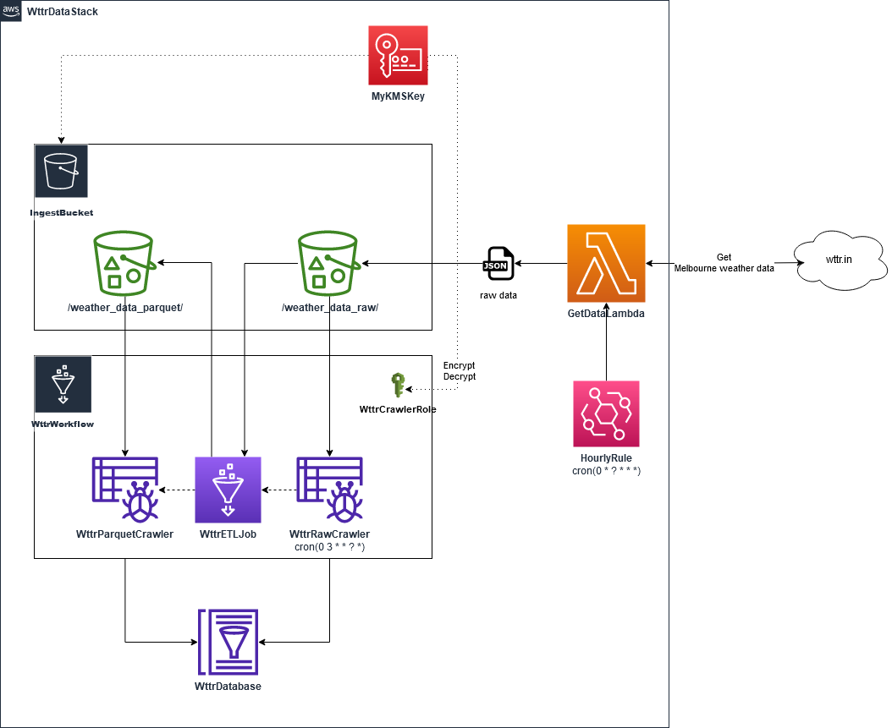

# Introduction

This repository is an experiment in using the AWS CDK to create a simple data ingestion stack.

# Overview

## Stack diagram



## High level description

- AWS Lambda is used to obtain Melbourne weather data from [Wttr.in](https://wttr.in/) with the query `https://wttr.in/Melbourne+VIC?format=j1`
  - Raw data format is JSON
  - Data is obtained hourly and stored in AWS S3
- AWS Glue workflow with:
  - Raw data crawler is triggered at 3:00 AM daily and builds a table in AWS Glue
  - ETL job is subsequently triggered after raw data crawler successfully finishes crawling. Transformed data is stored in AWS S3 as parquet files, paritioned by `areaName` and `localObsDate` (check [sample_raw_data.json](glue/sample_raw_data.json) file for an example of the raw data)
  - Parquet data crawler is subsequently triggered after ETL job sucessfully finishes and builds a table in AWS Glue

## Notes

- This stack will be environment-agnostic, a single synthesized template can be deployed anywhere
- Only one IAM role is used for Glue services
- Only one S3 bucket is used
- `aws_glue` and `aws_glue_alpha` were both used to experiment with both `AWS CDK v1` and `AWS CDK v2 (experimental)`
- Crawled parquet data can be further queried using other AWS services
- Only basic tests are created to test the stack

# Deployment

## Prerequisites

- AWS CDK installed
  - `npm install -g aws-cdk`
- AWS CLI configured with AWS credential with appropriate permissions to provision resources
  - `aws configure`
- Python 3 installed

## Optional stack parameters

`S3IngestBucketName`

- Name of S3 bucket to store raw data

`S3IngestRawDataPath`

- Path to raw data in S3 bucket
- Default: `weather-raw-data`

`S3IngestParquetDataPath`

- Path to parquet data in S3 bucket
- Default: `weather-parquet-data`

`LocationQueryString`

- Query string to be used to obtain weather data from Wttr.in
  ```python
  sample_request = requests.get(f'https://wttr.in/{LocationQueryString}?format=j1')
  ```
- Default: `Melbourne VIC`

## Deploy

1. Clone this repository
2. Create a Python virtual environment
   ```console
   python3 -m venv .venv
   ```
3. Activate the virtual environment
   - On MacOS or Linux
     ```console
     source .venv/bin/activate
     ```
   - On Windows
     ```console
     .venv\Scripts\activate
     ```
4. Install the required dependencies
   ```console
   pip install -r requirements.txt
   ```
5. Run
   ```console
   cdk bootstrap
   ```
   to bootstrap the stack
6. Run
   ```console
   cdk synth
   ```
   to synthesise the stack
   
   Synthesised template is stored in `.cdk.out` directory
7. Run
   ```console
   cdk deploy
   ```
   to deploy the stack (using the default AWS account and region)
   - `cdk deploy --profile <profile>` to deploy the stack using a specific AWS profile
   - To use stack parameters, provide multiple `--parameters` flags. Example:
        ```console
        cdk deploy \
            --parameters S3IngestBucketName=wttr-data-ingest \
            --parameters S3IngestRawDataPath=raw-data \
            --parameters S3IngestParquetDataPath=parquet-data \
            --parameters LocationQueryString="Springvale VIC"
        ```


## Dispose

Run `cdk destroy` to dispose the stack
